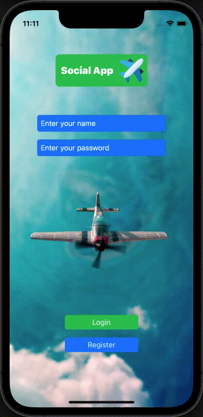

# Messenger App

## About the project / О проекте

###### English
In that application I desided to make a custom messenger service. Project is on early development stady. 
I wil push new commits and update project information by working on it 

###### Russian

В этом приложении я решил создать собственный мессенджер. Проект находится на стадии ранней разработки.
Я буду добавлять новые коммиты и обновлять информацию о проекте, работая над ним. 

## Previews / Превью

## Used technologies / Использованные технологии
- Swift
- UIKit without any storyboards (programmatically)
- Core Data
- Firebase
- GSD
- ARC
